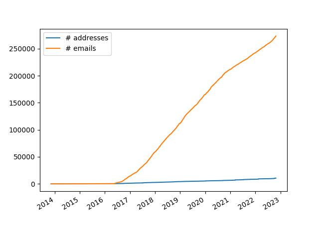

# Description

Generates a ranked addressbook from a maildir folder. It can be used in MUA's
like [aerc](aerc-mail.org) or [mutt](http://www.mutt.org/) by grepping the
list.

Why? No need to manually edit an address book, yet the cached ranking is
available extremely fast.

### Features:
- scans all your emails
- ranks based on both recency and frequency of addresses
- collects from To, Cc, Bcc and From fields
- ranks addresses explicitly emailed by you higher
- configurable output via go templates
- uses the most frequent display name for each email
- filters common "no reply" addresses
- normalizes emails to lower case
- "blazingly fast"*: crunch time for 270k emails is 7s on my machine, grepping from the output is instantaneous

*: compared to original python implementation for crunching (see Behind the scenes below) and compared to using notmuch query for address completion

### Planned features:

- configurable filtering based on regex

# Installation

The easiest way to install is running:
```
go install github.com/ferdinandyb/maildir-rank-addr@latest
```

# Usage

At the minimum, you need to specify where your maildir formatted email are:

```
maildir-rank-addr --maildir=~/.mail
```

For most use cases, it likely only needs to be run once or twice a day (cronjob
or systemd timer).

Supported flags:

```
      --addresses strings   comma separated list of your email addresses
      --maildir string      path to maildir folder
      --outputpath string   path to output file
      --template string     output template
```

By default results are output to
`$HOME/.cache/maildir-rank-addr/addressbook.tsv"`.

Besides the flags, toml formatted configuration file is also possible. It's
first looked for at `$HOME/.config/maildir-rank-addr/config` and then the
current working directory.

Complete example configuration with the default (aerc compatible) template:

```
maildir = "~/.mail"
addresses = [
    "address1@example.com",
    "address2@otherexample.com"
]
outputpath = "~/.mail/addressbook"
template = "{{.Address}}\t{{.Name}}"
```

If you do not provide your own addresses, classicifation based on your explicit
sends will not be possible!

## Integration

#### aerc

Put something like this in your aerc config:
```
address-book-cmd="ugrep -i --color=never %s $HOME/.cache/maildir-rank-addr/addressbook.tsv"
```

# Behind the scenes

## Ranking

Ranking is done in three steps. First all addresses seen are classified into
three classes:

- 2: from address is yours, address found in To, or Bcc
- 1: from address is yours, address found in Cc
- 0: From fields and anything else

The second step is ranking separately by frequency (how many times the address
has been seen) and recency (ordered by Date). These ranks are then combined to
form the final rank.

The classes are then ranked separately, the higher the class, the higher it
gets in the output file.

## Statistics

The amount of email I have seems to grow approximately linearly and the amount
of email addresses also more-or-less, but with a much-much smaller coefficient.
Compared to needing to grep the email headers caching the unique address leads
to a 250x compression. Since grep retains ordering of results in a file, it
also makes sense encoding rankings by simply ordering the addresses.

You can generate these images for yourself using the python script `stats/generateEmailStatistics.py`.




The `stats` folder also includes the original PoC implementation of this in
python (`stats/generateAddressbookMaildir.py`) which takes a whopping 36
_minutes_ to complete the same task, compared to this implementation's 10
_seconds_.

# Contribution

Patches sent in email are also accepted :)

# Similar Projects

- [maildir2addr](https://github.com/BourgeoisBear/maildir2addr)
- [notmuch-addrlookup-c](https://github.com/aperezdc/notmuch-addrlookup-c)


# Acknowledgments

Some functions for parsing email was taken from [aerc](aerc-mail.org).
